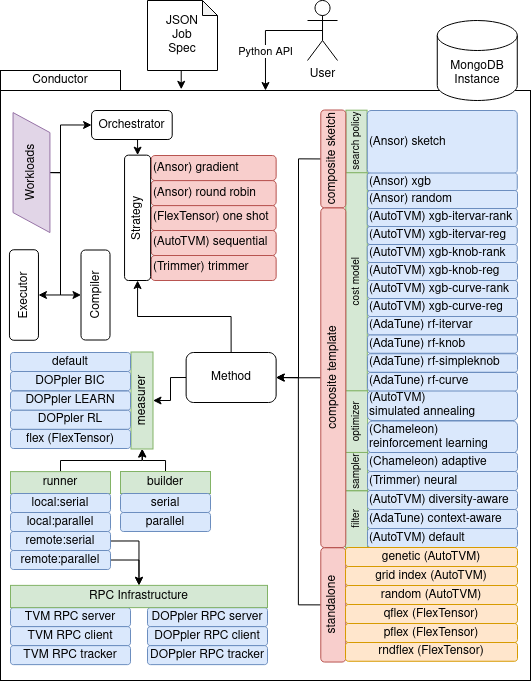
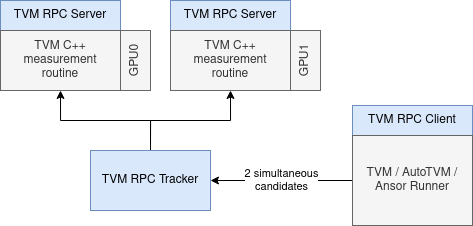
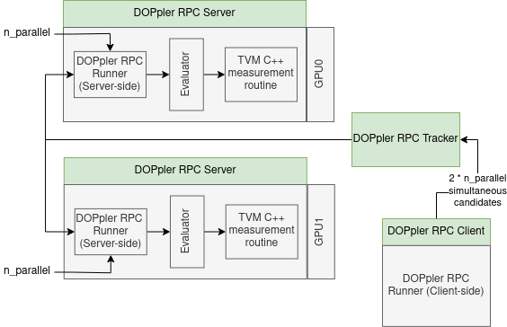

# Conductor + DOPpler

## About
Conductor is a modular framework that decompartmentalises existing TVM-based auto-tuners into primary subcomponents that can then be dynamically used to build up DL auto-tuners on the fly. Conductor provides standardised methods for measuring latency, runtime energy and intensity of DL tensor operators (programs) that are compatible with the dynamically generated auto-tuners. Finally, Conductor provides means to perform auto-tuning jobs via declarative (JSON) job specs as well as an API that could be integrated with other systems.

Up to date, Conductor includes and integrates components from the following TVM-based auto-tuners:
- AutoTVM
- Ansor
- AdaTune
- Chameleon
- FlexTensor
- Trimmer

Integration of these auto-tuners required careful consideration of many individual subcomponents of TVM-based auto-tuners. More specifically, Conductor standardizes usage of the following components adopted from the above auto-tuners and provides interfaces such that they can cooperate to construct auto-tuning scenarios dynamically.
- 1 search policy
- 12 unique cost models
- 2 unique optimizers
- 2 unique samplers
- 3 unique filters
- 6 standalone auto-tuning procedures
- 5 multi-tensor-program/operator auto-tuning strategies
- 8 measurers (Including several DOPpler variants)
- 2 builders
- 3 runners
- 2 RPC-based measurement infrastructures

This provides means for performing nearly **400,000** unique auto-tuning scenarios that each may impact auto-tuning results, behaviour, achieved tensor program / model performance and optimisation costs differently.

Furthermore, each component has its own set of unqiue configuration options that further increase the number of potential auto-tuning scenarios and provide room for experimentation. 

As part of the testing and evaluation of the framework, Conductor integrates with 6 DL frameworks (via TVM Relay bindings) to provide test workloads:
- Pytorch
- Tensorflow Lite
- Apache MXNet
- ONNX
- PaddlePaddle
- Keras

In total, there are over 350 unique models that can be imported and used from the above frameworks in Conductor.

Finally, Conductor provides nearly 80 standalone tensor programs adopted from the TVM's TOPI repository and made available via the `TensorProgram` API for testing and experimentation across both CPUs and GPUs - see `src/conductor/workloads/tensor_programs/testing.py` for more details.


## Required third party modules
Conductor relies on a modified version of the TVM Deep Learning Compiler.
The compiler is linked as a github submodule from a [separate repository](https://github.com/dborowiec10/tvm-conductor). See `.gitmodules` for more information.

Additionally, Conductor leverages MongoDB as the results database. This is currently necessary to be present for Conductor to work. A convenience script is provided within the `<PROJECT DIR>/scripts` directory (`install_mongo.sh`), which install mongodb on Debian-based Linux systems. Alternatively, see: [mongodb install](https://www.mongodb.com/docs/manual/tutorial/install-mongodb-on-ubuntu/)

### Modifications to the TVM codebase:
To enable more comprehensive profiling and improve the existing (C++) latency measurement procedures for tensor programs and models, Conductor modifies the existing TVM codebase.
As mentioned above, the modified codebase can be accessed at the following [repository](https://github.com/dborowiec10/tvm-conductor).
More specifically, Conductor introduces the following changes:
- Link additional Nvidia libraries to the TVM runtime / core build process (NVML, NVTX, NVPERF, CUPTI). These changes have been made within the following files:
    - : [https://github.com/dborowiec10/tvm-conductor/cmake/modules/CUDA.cmake](https://github.com/dborowiec10/tvm-conductor/cmake/modules/CUDA.cmake)
    - : [https://github.com/dborowiec10/tvm-conductor/cmake/utils/FindCUDA.cmake](https://github.com/dborowiec10/tvm-conductor/cmake/utils/FindCUDA.cmake)
    - : [https://github.com/dborowiec10/tvm-conductor/CMakeLists.txt](https://github.com/dborowiec10/tvm-conductor/CMakeLists.txt)
- Link additional library for parsing/handling JSON data (mainly used for configuration). Changes within:
    - : [https://github.com/dborowiec10/tvm-conductor/include/json/json.hpp](https://github.com/dborowiec10/tvm-conductor/include/json/json.hpp)

- Modify auto_scheduler (Ansor) C++/Python API to calculate theoretical_flop measure for each subgraph:
    - : [https://github.com/dborowiec10/tvm-conductor/include/tvm/auto_scheduler/measure.h](https://github.com/dborowiec10/tvm-conductor/include/tvm/auto_scheduler/measure.h)
    - : [https://github.com/dborowiec10/tvm-conductor/python/tvm/auto_scheduler/compute_dag.py](https://github.com/dborowiec10/tvm-conductor/include/tvm/auto_scheduler/measure.h)
    - : [https://github.com/dborowiec10/tvm-conductor/python/tvm/auto_scheduler/measure.py](https://github.com/dborowiec10/tvm-conductor/include/tvm/auto_scheduler/measure.h)
    - : [https://github.com/dborowiec10/tvm-conductor/python/tvm/auto_scheduler/measure_record.py](https://github.com/dborowiec10/tvm-conductor/include/tvm/auto_scheduler/measure.h)
    - : [https://github.com/dborowiec10/tvm-conductor/src/auto_scheduler/compute_dag.cc](https://github.com/dborowiec10/tvm-conductor/include/tvm/auto_scheduler/measure.h)
    - : [https://github.com/dborowiec10/tvm-conductor/src/auto_scheduler/measure.cc](https://github.com/dborowiec10/tvm-conductor/include/tvm/auto_scheduler/measure.h)
    - : [https://github.com/dborowiec10/tvm-conductor/src/auto_scheduler/measure_record.cc](https://github.com/dborowiec10/tvm-conductor/include/tvm/auto_scheduler/measure.h)


- Introduce Nvidia CUPTI / Profiler procedures for comprehensive profiling of kernels produced by TVM:
    - : [https://github.com/dborowiec10/tvm-conductor/include/tvm/runtime/profile/Eval.h](https://github.com/dborowiec10/tvm-conductor/include/tvm/runtime/profile/Eval.h)
    - : [https://github.com/dborowiec10/tvm-conductor/include/tvm/runtime/profile/FileOp.h](https://github.com/dborowiec10/tvm-conductor/include/tvm/runtime/profile/FileOp.h)
    - : [https://github.com/dborowiec10/tvm-conductor/include/tvm/runtime/profile/List.h](https://github.com/dborowiec10/tvm-conductor/include/tvm/runtime/profile/List.h)
    - : [https://github.com/dborowiec10/tvm-conductor/include/tvm/runtime/profile/Metric.h](https://github.com/dborowiec10/tvm-conductor/include/tvm/runtime/profile/Metric.h)
    - : [https://github.com/dborowiec10/tvm-conductor/include/tvm/runtime/profile/Parser.h](https://github.com/dborowiec10/tvm-conductor/include/tvm/runtime/profile/Parser.h)
    - : [https://github.com/dborowiec10/tvm-conductor/include/tvm/runtime/profile/ScopeExit.h](https://github.com/dborowiec10/tvm-conductor/include/tvm/runtime/profile/ScopeExit.h)
    - : [https://github.com/dborowiec10/tvm-conductor/include/tvm/runtime/profile/Utils.h](https://github.com/dborowiec10/tvm-conductor/include/tvm/runtime/profile/Utils.h)
    - : [https://github.com/dborowiec10/tvm-conductor/src/runtime/profile/Eval.cc](https://github.com/dborowiec10/tvm-conductor/src/runtime/profile/Eval.cc)
    - : [https://github.com/dborowiec10/tvm-conductor/src/runtime/profile/List.cc](https://github.com/dborowiec10/tvm-conductor/src/runtime/profile/List.cc)
    - : [https://github.com/dborowiec10/tvm-conductor/src/runtime/profile/Metric.cc](https://github.com/dborowiec10/tvm-conductor/src/runtime/profile/Metric.cc)
    - : [https://github.com/dborowiec10/tvm-conductor/src/runtime/profile/tvm_cupti_default.cc](https://github.com/dborowiec10/tvm-conductor/src/runtime/profile/tvm_cupti_default.cc)
    - : [https://github.com/dborowiec10/tvm-conductor/src/runtime/profile/tvm_cupti_prof.cc](https://github.com/dborowiec10/tvm-conductor/src/runtime/profile/tvm_cupti_prof.cc)
    - : [https://github.com/dborowiec10/tvm-conductor/include/tvm/runtime/profile/tvm_cupti_check.h](https://github.com/dborowiec10/tvm-conductor/include/tvm/runtime/profile/tvm_cupti_check.h)
    - : [https://github.com/dborowiec10/tvm-conductor/include/tvm/runtime/profile/tvm_cupti_default.h](https://github.com/dborowiec10/tvm-conductor/include/tvm/runtime/profile/tvm_cupti_default.h)
    - : [https://github.com/dborowiec10/tvm-conductor/include/tvm/runtime/profile/tvm_cupti_prof.h](https://github.com/dborowiec10/tvm-conductor/include/tvm/runtime/profile/tvm_cupti_prof.h)

- Introduce Nvidia NVML Activity API procedures for retrieving kernel information / kernel latency directly from device:
    - : [https://github.com/dborowiec10/tvm-conductor/src/runtime/profile/tvm_activity.cc](https://github.com/dborowiec10/tvm-conductor/src/runtime/profile/tvm_activity.cc)
    - : [https://github.com/dborowiec10/tvm-conductor/include/tvm/runtime/profile/tvm_activity.h](https://github.com/dborowiec10/tvm-conductor/include/tvm/runtime/profile/tvm_activity.h)

- Introduce additional low-level measurement procedures for measuring tensor program latency in C++ (via Nvidia NVML Activity API & comprehensive profiling via Nvidia CUPTI)
    - : [https://github.com/dborowiec10/tvm-conductor/src/runtime/rpc/rpc_module.cc](https://github.com/dborowiec10/tvm-conductor/src/runtime/rpc/rpc_module.cc)

## Setup
(**Note**): If you decide to run scripts provided within the `<PROJECT DIR>/scripts` directory, ensure they are executed from within the `<PROJECT DIR>` directory so that paths are recognised correctly.

### Prerequsites
This guide assumes a Debian-based Linux distribution (Ubuntu 20.04/22.04). For other environments, you may need to adapt some of these steps. You may choose to run: `sudo apt-get update` and `sudo apt-get upgrade` before any of the steps below.
- `python3`: can be installed using: `sudo apt-get install python3`
- `python3-dev`: can be installed using: `sudo apt-get install python3-dev`
- `python3-setuptools`: can be installed using: `sudo apt-get install python3-setuptools`
- `python-venv`: can be installed using: `sudo apt-get install -y python3-venv`
- `ninja`: can be installed using: `sudo apt-get install -y ninja-build`
- `cmake`: can be installed using: `sudo apt-get install -y cmake`
- `gcc`: can be installed using: `sudo apt-get install -y gcc`
- `libtinfo-dev`: can be installed using: `sudo apt-get install -y libtinfo-dev`
- `zlib1g-dev`: can be installed using: `sudo apt-get install -y zlib1g-dev`
- `build-essential`: can be installed using: `sudo apt-get install -y build-essential`
- `libedit-dev`: can be installed using: `sudo apt-get install -y libedit-dev`

As a single command:
```
sudo apt-get install -y python3 python3-dev python3-setuptools python-venv ninja-build cmake gcc libtinfo-dev zlib1g-dev build-essential libedit-dev
```

### Steps
1. Clone this repository
2. Ensure all git submodules are updated. E.g. use `scripts/update_submodules.sh` 
3. Install LLVM-11. For simplicity, the `scripts/install_llvm.sh` script can be used. Note the installation directory if your LLVM installation is different than `/usr/lib/llvm-11` and update step 7 accordingly.
4. Ensure recent version of Nvidia CUDA and Nvidia drivers are installed. Adjust step 6 accordingly if your installation of CUDA is located at a different path. The example assumes `/usr/local/cuda` to be the directory where CUDA is located. [Nvidia Drivers Installation Guide](https://www.linuxcapable.com/install-nvidia-drivers-on-ubuntu-linux/) & [Nvidia CUDA Installation Guide](https://docs.nvidia.com/cuda/cuda-installation-guide-linux/index.html)
5. Ensure MongoDB is installed. See section above for more details. (`scripts/install_mongo.sh`)
6. Update `<HOME>/.bashrc` or equivalent with the following. (Ensure to `source ~/.bashrc` before continuing with steps 7 and later)
```
export CC=/usr/bin/gcc
export CXX=/usr/bin/g++
export CUDACXX=/usr/local/cuda/bin/nvcc
export CPATH=/usr/local/cuda/include
export PATH=/usr/local/cuda/bin:$PATH
export CUDA_PATH=/usr/local/cuda
export LD_LIBRARY_PATH=/usr/local/lib
export LD_LIBRARY_PATH=/usr/local/cuda/lib64:$LD_LIBRARY_PATH
export LD_LIBRARY_PATH=/usr/lib/llvm-11/lib:$LD_LIBRARY_PATH
export LD_LIBRARY_PATH=/usr/local/cuda/extras/CUPTI/lib64:$LD_LIBRARY_PATH
export LD_LIBRARY_PATH=/usr/local/cuda/extras/CUPTI/lib64/stubs:$LD_LIBRARY_PATH
export LLVM_DIR=/usr/lib/llvm-11
export LIBRARY_PATH=/usr/local/cuda/lib64:$LLVM_DIR/lib
export TVM_ROOT=$HOME/<PROJECT_DIR>/tvm-conductor
export TVM_HOME=$TVM_ROOT/build
```

7. Create python virtual environment using the script: `scripts/create_venv.sh`
8. Activate the environment by sourcing the activate script like so: `source ./conductorvenv/bin/activate`. Alternatively run the activation script: `. ./scripts/activate.sh` remembering the dot at the beginning to run it in current shell.
9. Install TVM python dependencies as follows (ensure the virtual environment is active and that output of `which pip3` points to the `pip3` executable within the virtual environment):
```
pip3 install numpy decorator attrs typing-extensions tornado psutil xgboost cloudpickle scipy pybind11 cython
```
10. Install TVM using `scripts/install_tvm.sh`
11. Install Conductor python dependencies as follows:
```
pip3 install -r src/requirements.txt
```
12. Install Conductor: `scripts/install_conductor.sh`
13. Generate tensor program workloads: `scripts/generate_workloads.sh`. By default, workloads are saved to `CONDUCTOR_PATH/`, where CONDUCTOR_PATH is set within the run script or otherwise available within the shell env variables. By default, most scripts set this to `<HOME>/.conductor/`.

## Using Conductor
Conductor can be used by launching jobs specified in the json-based format using scripts as follows:
```bash
./scripts/jobs/run_job.sh ./jobs/serial/tensor_programs_cuda_standalone_template_grid_index/00_batch_matmul_51268830.cuda_standalone_template_grid_index_cuda.json
```

### Local auto-tuning jobs:
Conductor is capable of executing auto-tuning candidate measurements both locally and on remote hosts, utilising the TVM RPC infrastructure and the DOPpler RPC infrastructure. 
Local auto-tuning utilises GPU devices available locally (e.g. cuda:0, cuda:1 etc.), via the `local` runner component. The job can be configured such that any number of devices (usually MAX 4) are used to measure candidate executions locally. This can be specified in the configuration of the `measurer` component. E.g. within the configuration of the `default` measurer, the user can specify:
```json
{
    "entity": "measurer:default",
    "name": "measurer:default.1",
    "configuration": {
        "target": "cuda",
        "target_host": "llvm",
        "devices": [
            "localmachine:v100.0"
            "localmachine:v100.1"
            "localmachine:v100.2"
            "localmachine:v100.3"
        ],
        "nvidia_mps_devices": []
    }
},
```
to leverage cuda:0/1/2/3 devices.

### Parallelism during auto-tuning candidate measurements
Conductor runners enable parallel execution of candidate measurements, both locally and remotely. To indicate to conductor that more than one simultaneous candidate measurement should be performed, the user can set the `n_parallel` configuration options within the runner config definition, as follows:
```json
{
    "entity": "runner:local",
    "name": "runner:local.1",
    "configuration": {
        "cooldown_interval": 0.1,
        "timeout": 3,
        "n_parallel": 4
    }
},
```
If a single device is available for measurement (see above), 4 simultaneous cpu processes will be instantiated and candidates will attempt to execute their kernels on that 1 device, likely blocking at the CUDA driver level due to Nvidia scheduling architecture and performing actual kernel execution serially, unless Nvidia MPS is enabled. If there are more than 1 devices available, the number of simultaneous candidates will be = `n_parallel` times number of available devices. For example, with a 4xGPU machine and `n_parallel` set to 3, there will be 12 simultaneous candidates being executed.

### Remote auto-tuning jobs
There are two alternative ways of performing auto-tuning measurements on remote target-devices in Conductor. User can leverage the default TVM RPC infrastructure - e.g. TVM RPC Tracker / Server / Client via the `remote_tvm` runner, or they can use DOPpler's RPC infrastructure via the `remote_doppler` runner.

#### TVM RPC:
To start using the TVM's default RPC infrastructure, the RPC server(s) and the RPC tracker must be up and running and accessible to the machine that executes the auto-tuning Conductor job via the internet. A simple way to achieve that is to clone the repository and setup Conductor on the machines that are going to host the RPC servers, followed by:

- Starting the RPC tracker using:
```bash
./scripts/rpc/rpc_tracker_start.sh <tracker host> <tracker port>
```
followed by starting the RPC servers on machines that contain the target devices:
```bash
./scripts/rpc/rpc_server_start.sh unimachine:v100 0 <tracker host> <server host>
```
where `unimachine:v100` is the common key across the servers and `0` is the idx of the GPU.
Then, within the job's configuration, ensure to reflect that there are N separate devices as follows:
```json
{
    "entity": "measurer:default",
    "name": "measurer:default.1",
    "configuration": {
        "target": "cuda",
        "target_host": "llvm",
        "devices": [
            "unimachine:v100.0"
            "unimachine:v100.1"
            "unimachine:v100.2"
            "unimachine:v100.3"
        ],
        "nvidia_mps_devices": []
    }
}
```
This will tell Conductor's measurer that there are 4 unique devices available under key "unimachine:v100". The part before `.` will be used as the key to the TVM's RPC server infrastructure. Then when candidates are submitted for measurement, the parts after `.` will be reset to 0 to ensure session.device("cuda", dev_id) is correct. This is necessary because of how `CUDA_VISIBLE_DEVICES` at each TVM RPC Server indexes the available Nvidia devices. For example, even if the server was ran with the `gpu_idx` option of `1`, the underpinning TVM `nd.device()` will be still seeing it as `nd.device(0)` due to how the devices are indexed. For that reason, when splitting candidates across multiple devices, when the runner is `remote_tvm`, devices will be set to 0 in candidate mappings by the Conductor's measurer.

With respect to parallelism, it is advised to run the remote_tvm runner with `n_parallel=1` (same as it would be in default tvm RPC infrastructure). Behaviour with `n_parallel>1` is unpredictable as TVM's original RPC infrastructure has not been designed for execution of >1 simultaneous candidates. Conductor will automatically multiply `1 times N-servers` to perform `N` simultaneous measurements.

To leverage multiple devices on a single machine, instantiate multiple servers as follows:
```bash
./scripts/rpc/rpc_server_start.sh localmachine:v100 0 <tracker host> 0.0.0.0 9000
./scripts/rpc/rpc_server_start.sh localmachine:v100 1 <tracker host> 0.0.0.0 9000
./scripts/rpc/rpc_server_start.sh localmachine:v100 2 <tracker host> 0.0.0.0 9000
./scripts/rpc/rpc_server_start.sh localmachine:v100 3 <tracker host> 0.0.0.0 9000
```

To ensure things match up within the job, the job's measurer config should include the following `devices` definition. 
```json
{
    "entity": "measurer:default",
    "name": "measurer:default.1",
    "configuration": {
        "target": "cuda",
        "target_host": "llvm",
        "devices": [
            "localmachine:2080.0",
            "localmachine:2080.1"
            "localmachine:2080.2"
            "localmachine:2080.3"
        ],
        "nvidia_mps_devices": []
    }
},
```
TVM's RPC session will then handle allocation of the candidates to the available servers.

#### DOPpler RPC Infrastructure
To start using the DOPpler's RPC infrastructure, the RPC server(s) and the RPC tracker must be up and running and accessible to the machine that executes the auto-tuning Conductor job via the internet. A simple way to achieve that is to clone the repository and setup Conductor on the machines that are going to host the RPC servers, followed by:

- Starting the RPC tracker using:
```bash
./scripts/rpc/rpc_doppler_tracker_start.sh <tracker host> <tracker port>
```
followed by starting the RPC servers on machines that contain the target devices:
```bash
./scripts/rpc/rpc_doppler_server_start.sh remotemachine:v100 0 <tracker host> <server host>
./scripts/rpc/rpc_doppler_server_start.sh remotemachine2:v100 0 <tracker host> <server host>
./scripts/rpc/rpc_doppler_server_start.sh remotemachine3:v100 0 <tracker host> <server host>
./scripts/rpc/rpc_doppler_server_start.sh remotemachine4:v100 0 <tracker host> <server host>
```
where `remotemachine:v100` or `remotemachine2:v100` are the keys for each unique machine hosting an RPC server and `0` is the idx of the GPU.
Then, within the job's configuration, ensure to reflect that there are N separate devices as follows:
```json
{
    "entity": "measurer:default",
    "name": "measurer:default.1",
    "configuration": {
        "target": "cuda",
        "target_host": "llvm",
        "devices": [
            "remotemachine:v100.0"
            "remotemachine2:v100.0"
            "remotemachine3:v100.0"
            "remotemachine4:v100.0"
        ],
        "nvidia_mps_devices": []
    }
}
```

### Profiling with Nvidia Nsight systems / Nvprof
Conductor can be executed via Nvidia Nsight systems or Nvprof to gather more in-depth statistics about kernel executions as well as measurements of performance of specific portions of code within Conductor's components. To achieve this, run the following scripts for Nsight and Nvprof respectfully:
```bash
./scripts/run_job_nsight.sh jobs/doppler/serial.... unique_id_for_nsight
./scripts/run_job_nvprof.sh jobs/doppler/serial.... unique_id_for_nvprof
```

The `local` runner includes the following line:
```python
rng = nvtx.start_range("measure_candidates", color="purple")
```
which encapsulates the measurement procedure in Nvidia NVTX markers that will be attached to the Nvidia Nsight Systems report once completed. Likewise, to gather more fine grained marker range information, the user can use the `nvtx` evaluator within the job spec to introduce markers within the C++ evaluator routine that will also be gathered within the Nsight Systems report.
See `src/conductor/component/runner/local.py` and `src/conductor/component/evaluator/nvtx.py` for more information about the options.
The `parallel` builder component also includes the range:
```python
rng = nvtx.start_range("compile_candidates", color="green")
```
that captures the time it takes to compile the candidate tensor programs. This results in the Nsight Systems report to be a lot more comprehensive.


### Enabling Nvidia MPS
When considering parallel candidate execution (DOPpler's intial analysis and experimentation), one way to circumvent the serialisation of Nvidia kernels that originate from separate CPU processes is to enable Nvidia Multi Process Service (MPS). This can be achieved in two ways:
1. Globally enabling Nvidia MPS via the following script:
```bash
./scripts/nvidia-mps-start.sh
```
Use the following script to stop it:
```bash
./scripts/nvidia-mps-stop.sh
```

2. Specifying device indexes for which the MPS service should be enabled within the Conductor measurer configuration, like so:
```json
{
    "entity": "measurer:default",
    "name": "measurer:default.1",
    "configuration": {
        "target": "cuda",
        "target_host": "llvm",
        "devices": [
            "localmachine:v100.0"
        ],
        "nvidia_mps_devices": [0]
    }
},
```
When considering option 2, the Conductor's measurer will handle the management of the MPS server process. When executing auto-tuning jobs that involve DOPpler's measurers, it is advised the MPS is specified using option 2 since that enables DOPpler to turn the service on or off whenever needed (e.g. when )


## Concepts
Conductor can be used in different ways. Primarily, it can be leveraged as a job-based framework for auto-tuning DL models using dynamically orchestrated auto-tuners. To achieve that, Conductor relies on job-spec definitions (JSON) that specify an auto-tuning job configuration, including the workload, auto-tuner components, profilers and more. It is worth noting that Conductor can also perform these tasks as part of another project/application via its Python API.

### Architecture


### Methods and Method types
In Conductor, methods are unique auto-tuning procedures capable of auto-tuning a tensor program (standalone or based on an operator from a DL model). Conductor implements 3 unique method types:
- Standalone - these are methods that perform auto-tuning (e.g. candidate space search) based upon tightly-knit code that shares no similarities between other methods. For example, random, genetic or grid search methods from the AutoTVM auto-tuner are unique and simple-enough to not rely upon components such as cost models or optimizers, hence being standalon.
- Composite Template - these methods rely upon template-based schedule generation (candidate tensor program generation), where templates are provided by the TVM's TOPI. These methods are composite because they can be composed from several interchangeable components such as cost models, optimizers, filters, samplers and more.
- Composite Sketch - these methods rely upon sketch-based generation of candidates (adopted from the Ansor autoscheduler), where no templates are necessary during the candidate space search. These methods rely upon Ansor-specific cost models and search policies.

### Strategies
When considering auto-tuning entire DL models, auto-tuners typically adopt some form of strategy as to how much time and resources to dedicate to each operator when performing auto-tuning model-wide. Conductor standardises this concept and introduces the notion of strategies. For example, in AutoTVM, auto-tuning is typically performed sequentially (e.g. one operator of the model after another until completion / exhaustion of search space). In Conductor, such an approach is encapsulated within the `sequential` strategy. Likewise, Ansor utilises a gradient-based method to determine how much time and measurement trials to dedicate to each DL model operator. Conductor encapsulates this approach within the `gradient` strategy. In general, strategies are used in auto-tuning scenarios that involve either a DL model as input or multiple standalone tensor programs as an input. 

### Measurers, Builders and Runners and Evaluators
In conventional TVM auto-tuning infrastructure, there are two core components that manage the measurement of candidate tensor program latencies: the `runner` and the `builder`. A their names suggest, the `builder` "builds" or compiles the candidates while the `runner` executes them and measures their latency. Given this infrastructure is largely bespoke to the auto-tuner: e.g. AutoTVM and Ansor have separate builders and runners that are compatible only with their respective sub-codebases. Conductor decompartmentalises these functionalities and introduces a well defined API for compiling and measuring candidate tensor programs.

Conductor also introduces the concept of a `measurer`, a component that interacts with both the builder and runner to orchestrate timely candidate measurements. For implementation details, see: `src/conductor/component/measurer/...`. The default approach within the conventional TVM-based auto-tuners is to first compile all candidates and then execute them serially for measurement. Within Conductor, this is represented by the `default` measurer.
This approach can be sub-optimal since serial execution occupies the target-device for a long time and results in vastly underutilised resources over time. DOPpler is a project that attempts to tackle this by introducing means for parallel measurements of candidate latency to be performed. The main version of DOPpler - DOPpler BIC (`src/codnuctor/component/measurer/doppler_bic.py`) manages the measurement procedure such that the optimal number of simultaneous measurements are being performed for maximised parallelism and minimised inaccuracy of measurements. 

The actual measurement, both in the case of traditional TVM auto-tuning and Conductor's infrastructure is performed within the TVM's C++ codebase. Both Ansor and AutoTVM use their own bespoke methods for performing these measurements at the level of C++. Conductor unifies this infrastructure via the `evaluator` abstraction layer. An `evaluator` Python component within Conductor maps to functions defined within the `tvm-conductor` repository (modified TVM) to allow for a unified API of performing low-level latency measurements. This unification enabled development of other types of `evaluators` such as the CUPTI evaluator or the NVTX evaluator which enable more comprehensive performance and resource profiling of Nvidia-based target-device measurements. Crucially for DOPpler, this abstraction enabled development of the `activity` evaluator (`src/conductor/component/evaluator/activity.py`) which utilises Nvidia Activity API calls to collect kernel latency measurements directly from the target-device. Conventionally, TVM's infrastructure would rely upon CPU-level timestamps to measure latency of individual tensor programs that execute kernels on the GPU. Achieving high-accuracy becomes crucially important when considering parallel tensor program executions such as in the case of DOPpler.


### RPC infrastructures
Conductor enables 2 separate RPC infrastructures for performing remote candidate latency measurements. 1 - the conventional TVM RPC infrastructure involving the Tracker, Client and multiple Servers where each server is instantiated per GPU. 2 - DOPpler's RPC infrastructure, which replicates the `runner` and `evaluator` components server-side to enable reuse of components that enable parallel candidate executions both locally and remotely. To enable this, the DOPpler's RPC infrastructure introduces its own Client, Tracker and Server components that extend the functionality of the conventional infrastructure. Below are two diagrams depicting the differences between the two infrastructures. Crucially, DOPpler's RPC infrastructure enables parallel candidate measurements to be performed server-side on remote target-devices. In conventional TVM RPC infrastructure, this would not be possible due to the way in which the infrastructure is designed and the assumptions it makes about candidate executions (e.g. the scheduler within TVM RPC Tracker). Moreover, experimentation with different evaluators such as the `activity` evaluator used by DOPpler would not be possible within the conventional TVM RPC infrastructure.

#### Conventional TVM RPC infrastructure


#### DOPpler's RPC infrastructure


### Job specification
Conductor jobs are specified via JSON files as follows:

- `job_name_prefix`: specifies a prefix that will be prepended to job name
- `inputs`: list of input workloads (tensor programs, models) to load during job execution
- `metadata`: arbitrary object containing user-specified metadata, attached to results stored in MongoDB
- `specifications`: specify composition of the task - e.g. how the auto-tuner should be constructed, how specific tensor program workloads should be mapped to auto-tuners, what strategy to use with multiple tensor programs (e.g. model-wide tuning).
- `task`: specifies task to be executed and how the specifications, configurations, inputs and profilers link together to form a unique auto-tuning, compilation or execution task.
- `configurations`: specify configurations for various components within Conductor - confgurations are automatically linked to their respective components at runtime based on entity and name identifiers.

```json
{
    "job_name_prefix": "bert_mxnet_b1_0_composite_ansor_cuda_tp_run_0",
    "inputs": [
        {"name": "sh_0", "type": "tensor_program", "identifier": "bert_0"}
    ],
    "metadata": {
        "platform": "intelv100",
        "autotuner": "ansor",
        "approach": "doppler",
        "model": "bert",
        "dop": "doppler_bic",
        "run_idx": 0
    },
    "specifications": [
        {
            "name": "meth_composite_sketch_ansor_xgb_ansor_sketch",
            "type": "method",
            "spec": {
                "scheduling": "sketch",
                "kind": "composite",
                "method_name": null,
                "cost_model": "ansor_xgb",
                "optimizer": null,
                "search_policy": "ansor_sketch",
                "sampler": null,
                "filter": null
            },
            "settings": {}
        },
        {...},
        {...}
    ],
    "task": {
        "name": "test_task",
        "type": "orchestrator:default",
        "inputs": ["sh_0"],
        "outputs": ["t_sh_0"],
        "specifications": [
            "meth_composite_sketch_ansor_xgb_ansor_sketch",
            {...},
            {...}
        ],
        "configurations": [
            "measurer:doppler_bic.1",
            "method:sketch:composite.1",
            {...},
            {...}
        ],
        "profilers": [
            {
                "type": "time_profiler", 
                "scope": "strategy", 
                "configuration": "time_profiler.1",
                "collection": "strategy_runs"
            },
            {...},
            {...}
        ]
    },
    "configurations": [
        {
            "entity": "measurer:doppler_bic",
            "name": "measurer:doppler_bic.1",
            "configuration": {
                "target_host": "llvm",
                "target": "cuda",
                "fixed_timeout": false,
                "rank_remeasure_perc": 0.01,
                "devices": [0],
            }
        },
        {...},
        {...}
    ]

}
```

### Tasks
Conductor supports 5 types of tasks as defined in `src/conductor/job/tasks.py`:
1. `compiler:tensor_program`: compiles tensor program inputs specified within the job. It relies on the `CompilationSpecification` to be provided within the job spec. See `src/conductor/compiler/_base.py` for details. Below is an example of a compiler task specification that configures the behaviour of the task:
```json
...
{
    "name": "test_compilation_spec",
    "type": "compilation",
    "spec": {
        "group_type": "tensor_program",
        "options": {
            "target": "nvidia/nvidia-v100",
            "target_host": "llvm",
            "target_opts": null,
            "save_tensor_program": true,
            "save_source": true,
            "ext_compiler": null,
            "ext_compiler_options": null,
            "instr_count": false,
            "pass_configurations": {},
            "implementations_type": "sketch",
            "implementations_path": "ansor_test_tensor_program.log"
        },
        "maps": [
            {
                "input": "tp_0",
                "output": "c_tp_0"
            }
        ]
    }
}
...
```

2. `compiler:model`: compiles model inputs specified within the job. Much like in the case of `compiler:tensor_program`, `compiler:model` tasks rely on the `CompilationSpecification` to be configured. Example of a compiler task specification for models is shown below:
```json
...
{
    "name": "test_compilation_spec",
    "type": "compilation",
    "spec": {
        "group_type": "model",
        "options": {
            "target": "nvidia/nvidia-v100",
            "target_host": "llvm",
            "target_opts": null,
            "save_model": true,
            "save_source": true,
            "ext_compiler": null,
            "ext_compiler_options": null,
            "opt_level": 3,
            "instr_count": false,
            "required_passes": [],
            "disabled_passes": [],
            "pass_configurations": {},
            "implementations_type": "sketch",
            "implementations_path": "ansor_alexnet.log"
        },
        "maps": [
            {
                "input": "cm_0",
                "output": "c_cm_0"
            }
        ]
    }
}
...
```

3. `executor.tensor_program`: executes a tensor program for testing and profiling purposes. It relies on the `ExecutionSpecification` to be configured, found within `src/executor/_base.py`. Example of an executor task specification for tensor programs is shown below:
```json
...
{
    "name": "test_execution_spec",
    "type": "execution",
    "spec": {
        "group_type": "tensor_program",
        "evaluator": "default",
        "options": {
            "device_type": "cuda",
            "device_id": 0,
            "fill_mode": "random"
        },
        "maps": [
            {
                "input": "ctp_0",
                "output": null
            }
        ]
    }
}

...
```
4. `executor.model`: executes a model for testing and profiling purposes, relying upon the `ExecutionSpecification` to be configured. Example of an executor task specification for models is shown below:
```json
...
{
    "name": "test_execution_spec",
    "type": "execution",
    "spec": {
        "group_type": "model",
        "evaluator": "default",
        "options": {
            "device_type": "cuda",
            "device_id": 0,
            "fill_mode": "random"
        },
        "maps": [
            {
                "input": "cm_0",
                "output": null
            }
        ]
    }
}
...
```
5. `orchestrator:default`: performs tensor_operator/model auto-tuning using a dynamically constructed DL auto-tuner. Orchestration is specified using the `OrchestratorSpecification` found in `src/conductor/orchestrator/_base.py`. The orchestrator relies on 3 specifications. First, the `OrchestratorSpecification` determines the measurement infrastructure and basic settings such as the number of candidate trials per tensor program being auto-tuned. Second is the `MethodSpecification` (see `src/conductor/component/specification.py` for details), which determines the components of the dynamically constructed auto-tuner. Finally, the `InputMethodMapSpecification` (see `src/conductor/component/specification.py` for details), determines the mapping between input tensor programs / model operators and the methods (dynamic auto-tuner instances) being constructed. The `InputMethodMapSpecification` also determines the multi-operator/tensor_program auto-tuning strategy (which determines the proportion of time/resources being allocated) Examples of these specifications are provided below:
```json
(OrchestratorSpecification)...
{
    "name": "orchestrator_spec",
    "type": "orchestrator",
    "spec": {
        "orchestrator": "default",
        "measurer": "default",
        "builder": "parallel",
        "runner": "local:parallel",
        "evaluator": "default"
    },
    "settings": {
        "num_trials": 500,
        "batch_size": 64,
        "early_stop": null
    }
},
...
(MethodSpecification)...
{
    "name": "template_grid_index_method",
    "type": "method",
    "spec": {
        "scheduling": "template",
        "kind": "standalone",
        "method_name": "grid_index",
        "cost_model": null,
        "optimizer": null,
        "search_policy": null,
        "sampler": null,
        "filter": null
    },
    "settings": {}
},
...
(InputMethodMapSpecification)...
{
    "name": "test_input_method_map",
    "type": "input_method_map",
    "spec": {
        "strategy": "sequential",
        "group_type": "tensor_program",
        "maps": [
            {
                "input": "tp_0",
                "output": "t_sh_0",
                "method": "template_grid_index_method"
            }
        ]
    }
}
...
```

### Inputs / Workloads
Conductor job specs refer to inputs that are either standalone tensor programs or DL models.
Under the hood, Conductor decomposes DL models into standalone tensor programs for auto-tuning and other processing.
To manage workloads in a consistent manner, Conductor abstracts over existing model and tensor program definitions using Conductor-specific objects.
Tensor programs are represented by the `TensorProgram` class found in `src/conductor/tensor_program.py` and models are represented by the `Model` class
defined within `src/conductor/model.py`. There are also `CompiledModel` and `CompiledTensorProgram` classes that represent models and tensor programs that
have been compiled and are ready to be executed, where in all cases the objects are fully serializable.

To link JSON-based job specification of Conductor inputs, the following classes are also included, which instantiate the respective `TensorProgram`, `Model`, `CompiledTensorProgram` and `CompiledModel` objects, namely:
- `ModelInputOutputSpecification` - `src/conductor/model.py`
- `CompiledModelInputOutputSpecification` - `src/conductor/model.py`
- `TensorProgramInputOutputSpecification` - `src/conductor/tensor_program.py`
- `CompiledTensorProgramInputOutputSpecification` - `src/conductor/tensor_program.py`

Each model in Conductor originates from 1 of 7 potential source DL frameworks, where the conversion is facilitated by TVM's relay binding function.
Conductor unifies and standardises the way in which these models are loaded and converted, enabling effective experimentation to be performed.
Conductor links to the following DL model sources:
- TVM (testing repo) - model definitions available in `src/conductor/workloads/models/tvmmods.py`
- Pytorch - model definitions available in `src/conductor/workloads/models/pytorch.py`
- Apache MXNet - model definitions available in `src/conductor/workloads/models/mxnet.py`
- Keras - model definitions available in `src/conductor/workloads/models/keras.py`
- PaddlePaddle - model definitions available in `src/conductor/workloads/models/paddle.py`
- Tensorflow Lite - model definitions available in `src/conductor/workloads/models/tflite.py`
- ONNX - model definitions available in `src/conductor/workloads/models/onnx.py`

For testing purposes, Conductor also includes a list of pre-defined standalone tensor programs that span a wide range of potential DL workloads across many shapes and sizes.
Definitions of these tensor programs can be found in `src/conductor/workloads/tensor_programs/definitions.py`


### Profilers
Conductor provides standardized infrastructure for measuring performance of tensor programs and models at various levels of granularity.
Alongside runtime latency measurements, Conductor enables collection of energy/power consumption at both the CPU and GPU levels via
RAPL MSR and Nvidia NVML interfaces. This profiling functionality is abstracted using the `Profiler` and `Profilable` classes found in `src/conductor/profiler/*`. When any of Conductor components implements the `Profilable` interface, it automatically becomes capable of being profiled by various profilers implemented within Conductor. As an example, see the `Runner` base class below:
```python
class Runner(Configurable, Profilable):
    _name = "runner"
    
    def __repr__(self):
        return Runner._name

    def __init__(self, subtypes, evaluator, configs=None, child_default_configs={}, profilers_specs=[]):
        Configurable.__init__(self, "runner", subtypes, configs, Configurable.merge_configs({
            "cooldown_interval": 0.1,
            "timeout": 3
        }, child_default_configs, override_first=True))

        Profilable.__init__(self, "runner", ["time_profiler"], specs=profilers_specs)

```

Each component implementing the `Profilable` interface must call profiling checkpoint methods such as `self.start_profilers(context=ctx)`, which control start, stop, and persistence of profiling, including writing results to the MongoDB database.
There are several profilers that are implemented within Conductor, including time profiler, system monitor and powercap profiler.

In the context of JSON-based job specification, profilers are attached to components and the task within the following part of the specification:
```json
...
"profilers": [
    {
        "type": "time_profiler",
        "scope": "strategy",
        "configuration": "time_profiler.1",
        "collection": "strategy_runs"
    },
    {
        "type": "time_profiler",
        "scope": "method",
        "configuration": "time_profiler.1",
        "collection": "method_runs"
    },
    {
        "type": "time_profiler",
        "scope": "builder",
        "configuration": "time_profiler.1",
        "collection": "compilations"
    },
    {
        "type": "time_profiler",
        "scope": "runner",
        "configuration": "time_profiler.1",
        "collection": "measurements"
    },
    {
        "type": "system_monitor",
        "scope": "strategy",
        "configuration": "system_monitor.1",
        "collection": "sysmons"
    }
]
...
```

Here, each profiler is assigned to a scope (e.g. strategy, method, runner etc.), which determines within which component the profiler will be activated. Each profiler is also assigned a specific configuration spec that configures its behaviour (more on configuration specs below). Lastly, each compiler definition specifies a `collection` which creates a separate collection for its result data within the MongoDB database.


### Component configuration
To achieve modularity and cross-compatibility between various auto-tuner components, Conductor implements a standardised API for configuring components. For a component to be configurable, it must implement the `Configurable` interface (see `src/conductor/_base.py`) which handles configuration parsing and partial configuration matching (e.g. user has not specified all required configuration options within the JSON spec, so the default values must be used).

This functionality directly maps to JSON-based specs provided within each job. E.g. the configuration spec entry for the system monitor profiler maps to the configuration options used by the system monitor profiler within the Python API:
```json
...
{
    "entity": "system_monitor",
    "name": "system_monitor.1",
    "configuration": {
        "gpus": [
            1
        ],
        "poll_interval": 1,
        "metrics": {
            "host_cpu_freq": true,
            "host_cpu_util_user": true,
            "host_cpu_util_nice": true,
            "host_cpu_util_system": true,
            "host_cpu_util_idle": true,
            "host_cpu_util_iowait": true,
            "host_cpu_util_irq": true,
            "host_cpu_util_softirq": true,
            "host_cpu_util_perc": true,
            "host_mem_prc": true,
            "gpu_mem_free": true,
            "gpu_mem_used": true,
            "gpu_mem_total": true,
            "gpu_util": true,
            "gpu_mem_util": true,
            "gpu_power": true,
            "gpu_clock_sm": true,
            "gpu_clock_mem": true
        }
    }
}
...
```
```python
...
class SystemMonitor(Profiler):
    _name = "system_monitor"
    possible_cpu_metrics = [
        "host_cpu_util_user", "host_cpu_util_nice", "host_cpu_util_system", 
        "host_cpu_util_idle", "host_cpu_util_iowait", "host_cpu_util_irq", 
        "host_cpu_util_softirq", "host_cpu_freq", "host_cpu_util_perc", "host_mem_prc"
    ]
    possible_gpu_metrics = [
        "gpu_mem_free", "gpu_mem_used", "gpu_mem_total", "gpu_util", 
        "gpu_mem_util", "gpu_power", "gpu_clock_sm", "gpu_clock_mem"
    ]

    def __repr__(self):
        return Profiler.__repr__(self) + ":" + SystemMonitor._name

    def __init__(self, _scope, _collection, configs=None, child_default_configs={}):
        Profiler.__init__(self, "system_monitor", "", _scope, _collection, configs=configs, child_default_configs=Configurable.merge_configs({
            "gpus": [0],
            "poll_interval": 0.5,
            "metrics": {
                "host_cpu_util_user": False,
                "host_cpu_util_nice": False,
                "host_cpu_util_system": False,
                "host_cpu_util_idle": False,
                "host_cpu_util_iowait": False,
                "host_cpu_util_irq": False,
                "host_cpu_util_softirq": False,
                "host_cpu_freq": False,
                "host_cpu_util_perc": True,
                "host_mem_prc": False,
                "gpu_mem_free": False,
                "gpu_mem_used": False,
                "gpu_mem_total": False,
                "gpu_util": True,
                "gpu_mem_util": True,
                "gpu_power": True,
                "gpu_clock_sm": False,
                "gpu_clock_mem": False
            }
        }, child_default_configs, override_first=True))
...
```
where the `Profiler` base class implements the `Configurable` interface.
This enables Conductor to standardise the way each component is configured and make it work across both the JSON-based and Python APIs seamlessly. All configuration of a `Configurable` component is then available within the `self.config` dictionary property of the object.


### Directory structure
Below is an overview of Conductor's source code and roughly what each submodule/file is responsible for.

```
<PROJECT DIR>
|-📂scripts:
| |-📂jobs:
| | |-📜[run_job.sh]          Run a job
| | |-📜[run_job_bg.sh]       Run a job with nohup in the background
| | |-📜[run_job_fg.sh]       Run a job with nohup in the foreground
| | |-📜[run_job_nsight.sh]   Run a job, profile with Nvidia Nsight
| | |-📜[run_job_nvprof.sh]   Run a job, profile Nvidia Nvprof
| | |-📜[run_jobs.sh]         Run multiple jobs
| | |-📜[run_jobs_nsight.sh]  Run multiple jobs, profile Nvidia Nsight
| |
| |-📂rpc
| | |-📜[rpc_doppler_server_start.sh]   Run doppler RPC server
| | |-📜[rpc_doppler_tracker_start.sh]  Run doppler RPC tracker
| | |-📜[rpc_server_start.sh]           Run TVM RPC server
| | |-📜[rpc_tracker_query.sh]          Query TVM RPC tracker
| | |-📜[rpc_tracker_start.sh]          Run TVM RPC tracker
| |
| |-📜[activate.sh]            Activate virtual environment
| |-📜[create_venv.sh]         Create virtual environment
| |-📜[freeze.sh]              Save Conductor Python dependencies
| |-📜[generate_workloads.sh]  Generate and save tensor_program workloads
| |-📜[install_conductor.sh]   Install conductor to virtualenv
| |-📜[install_llvm.sh]        Install LLVM-11
| |-📜[install_mongo.sh]       Install MongoDB
| |-📜[install_tvm.sh]         Compile & Install modified TVM
| |-📜[kill.sh]                Kill all processes associated with Conductor
| |-📜[nvidia-mps-tart.sh]     Start Nvidia MPS server
| |-📜[nvidia-mps-top.sh]      Stop Nvidia MPS server
| |-📜[run_in_env.sh]          Run a python script in Conductor's environment
| |-📜[update_submodules.sh]   update git submodules - TVM + its inner ones
|
|-📂data           [Contains results of jobs (logs)]
|-📂conductorvenv  [Python virtual environment]
|-📂tvm-conductor  [Modified TVM compiler submodule]
|-📂workloads      [scripts for generating workloads]
|-📂src
| |-📜setup.py 
| |-📂conductor
| | |-📜_base.py           [Some base classes]
| | |-📜experiment.py      [Context for managing an experiment]
| | |-📜main.py            [Entrypoint to Conductor]
| | |-📜mediation.py       [Binding layer between Conductor and TVM]
| | |-📜model.py           [Functional definition of a model]
| | |-📜store.py           [Comms layer between Conductor and MongoDB]
| | |-📜tensor_program.py  [Functional definition of a tensor program]
| | |-📜utils.py           [Some frequently used functions across the project]
| | |...
| | |-📂job                [Conductor job management]
| | |-📂compiler           [Model/Tensor program compiler component (job-based)]
| | |-📂executor           [Model/Tensor program executor component (job-based)]
| | |-📂orchestrator       [Dynamically orchestrate auto-tuners from components]
| | |...
| | |-📂component          [Components used to dynamically create auto-tuners] 
| | | |-📂strategy         [Allocate tuning time / trials per operator during auto-tuning]
| | | |-📂search_policy    [Auto-tuner search algorithm policies]
| | | |-📂cost_model       [Auto-tuner cost models]
| | | |-📂optimizer        [Auto-tuner search algorithm optimizers]
| | | |-📂sampler          [Auto-tuner samplers]
| | | |-📂filter           [Auto-tuner filters]
| | | |-📂evaluator        [Auto-tuner evaluators (low-level cand. execution measurement)]
| | | |-📂method           [Auto-tuner skeletons]
| | | |-📂scheduler        [Auto-tuner schedule/candidate generators]
| | | |...
| | | |-📂runner           [Manage candidate executions during measurement]
| | | |-📂builder          [Manage candidate compilation ahead of measurement]
| | | |-📂measurer         [Manage builder/runner execution life-cycle]
| | | | |-...
| | | | |-📜doppler_bic.py [DOPpler measurer]
| | | | |-...
| | | | 
| | | |-📂rpc              [Manage the RPC candidate measurement infrastructure]
| | | | |-📂default        [Default TVM RPC measurement infrastructure]
| | | | |-📂doppler        [DOPpler's parallel measurement infrastructure]
| | | | 
| | |-📂configurer         [Manages life-cycle/context of auto-tuning records]
| | |-📂profiler           [Various profilers (time, energy consumption of CPU/GPU)]
| | |-📂worker             [Generic worker process and routines]
| | |-📂workloads          [Definitions and specifications for Conductor workloads]
```
